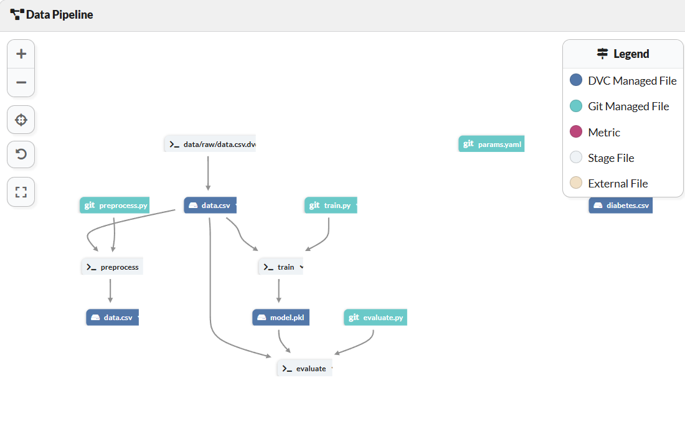

# Diabetes Prediction ML Pipeline

This project implements a **reproducible machine learning pipeline** to predict diabetes using a **Random Forest Classifier**. The pipeline is managed using **DVC** for data versioning and **MLflow** for experiment tracking, logging metrics, and monitoring models.

## Features
- **DVC-based stages**: preprocess, train, evaluate.
- **MLflow integration** for tracking experiments, logging parameters, metrics, and models.
- **Hyperparameter tuning** with `GridSearchCV`.
- **Reproducible results** with versioned data and model artifacts.

## Data Pipeline Overview

The following diagram shows the DVC pipeline stages in this project:

